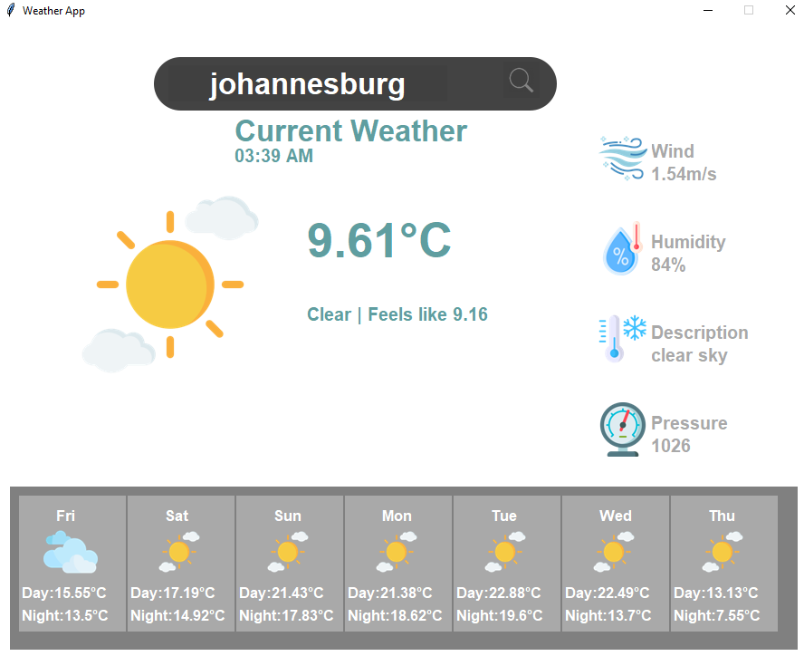

Here’s the complete `README.md` file with all the sections included:

# Weather App

A simple weather application built with Python and Tkinter that fetches weather data using the OpenWeatherMap API.

## Features

- Search for current weather by city.
- Display weather details including temperature, humidity, wind speed, and more.
- Show 7-day weather forecast.

## Installation

1. Clone the repository:
    ```sh
    git clone https://github.com/Hectorvee/weather-app.git
    cd weather-app
    ```

2. Create a virtual environment and activate it:
    ```sh
    python -m venv venv
    source venv/bin/activate  # On Windows use `venv\Scripts\activate`
    ```

3. Install the required packages:
    ```sh
    pip install -r requirements.txt
    ```

4. Set up your OpenWeatherMap API key:
    ```sh
    export OPENWEATHER_API_KEY='YOUR_API_KEY'  # On Windows use `set OPENWEATHER_API_KEY=your_api_key_here`
    ```

## Usage

Run the application:
python main.py

## Screenshot

Here's a preview of the Weather App:



## Contributing

Feel free to submit issues or pull requests. Contributions are welcome!

## License

This project is licensed under the MIT License. See the [LICENSE](LICENSE) file for details.

